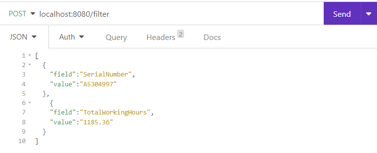

# Telemetry Data Application

This application is designed to upload, process and search for telemetry data from either tractor or combine. Telemetry
data refers to the information collected by software applications or systems during their operation, which can include
usage patterns, performance metrics, and other data related to user behavior and system health.

## Features

- Upload telemetry data from CSV files.
- Process telemetry data.
- Search for telemetry data using specified filters.

## Startup

To run this application, you need to have the following requirements:

- Java 17
- Maven
- Ideally some IDE (e.g. IntelliJ)

To install the dependencies, run the following command in the project directory:

```mvn
maven clean install -T 1C -DskipTests
```

### Running the application

Open your IDE, and setup run configuration as on the screenshot:


Or just open the file on the location 'evaluation\.run'

Run it by pressing on Run button

## Usage of the app

The app supports only two endpoint at the moment. One for uploading the data, and another one to filter the data.

### Uploading the CSV data for processing

To upload the CSV, you need to open some app that supports sending POST request (e.g. Postman, or Insomnia). We will use
Insomnia in our examples (you can find the request collection file in the same path as a run
configuration `evaluation\.run\`).

Once you open Insomnia, create a new request. As a **method** choose **POST**, as a URL enter: `localhost:8080/upload`
same as it is shown on the screenshot below:


As body, choose multipart, and add `file`. It's as easy as that! :)

Click on the right side, and find your CSV file. **Make sure that it is named correctly!** All CSV files whose names
start with **LD_A**, are considered as containing Tractor data, and if it starts with **LD_C** it's assumed that it is
containing Combine data. For other types of equipment we are planning on adding support in the future.

Once you press send, the data is validated, processed and stored in the database, and ready for filtering. Since some
rows may contain invalid data, those rows are skipped, and everything else is stored in the database. You can check logs
for more info about the not processed rows. But in response, you will see how many rows were loaded in the database
successfully. We're planning on extending this functionality, with the reason why some specific rows weren't
successfully processed.

### Filtering the vehicle data

Once you have all your data ready, you may want to filter it based on some criteria. We're supporting all kinds of
filters, but if you are using more than one, all of them need to be satisfied for the result to be returned. Also,
mixing some combine or tractor specific filters will result in empty result response.

To filter the data, you can find the request already in provided Insomina collection. Or, you can create it by following
these steps:

1. Create new request
2. Set method to POST
3. Set URL to 'localhost:8080/filter'
4. Choose JSON as a body type
5. Enter the filters in the body. Example of the filter body below screenshot
   

Example of request body:

```json
[
  {
    "field": "SerialNumber",
    "value": "A5304997"
  },
  {
    "field": "TotalWorkingHours",
    "value": "1185.36",
    "operation": "lessThan"
  }
]
```

As you can see on the json above, to have more than one filter you just need to add new json section, the one between
curly brackets (`{}`). Mandatory fields for the filter are "field" and "value". Operation is optional, as you don't have
to provide it, and can use default operation **equals**.

#### Caution

Have in mind that not all fields can be filtered using all operations. So, for example, lessThan, greaterThan, can't be
used for textual fields. Contains can't be used for numerical, dates or boolean fields (all on/off, active/inactive
fields). If some such filters are provided, they will be invalidated, and not used.

#### Supported operation per type

| Type\Operation   | Equals    | Less than     | Greater than  | Contains      |
|------------------|-----------|---------------|---------------|---------------|
| Text             | Supported | Not supported | Not supported | Supported     |
| Date             | Supported | Supported     | Supported     | Not supported |
| Whole numbers    | Supported | Supported     | Supported     | Not supported |
| Decimal numbers  | Supported | Supported     | Supported     | Not supported |
| Booleans (flags) | Supported | Not supported | Not supported | Not supported |

#### Type of fields

| Field type       | Field name                       |
|------------------|----------------------------------|
| Date             | Timestamp                        |
| Text             | SerialNumber                     |
| Text             | GpsLongitude                     |
| Text             | GpsLatitude                      |
| Text             | TypeOfCrop                       |
| Decimal numbers  | TotalWorkingHours                |
| Decimal numbers  | GroundSpeed                      |
| Decimal numbers  | SeparationLosses                 |
| Decimal numbers  | SieveLosses                      |
| Decimal numbers  | DieselTankLevel                  |
| Decimal numbers  | GrainInReturns                   |
| Decimal numbers  | ChannelPosition                  |
| Decimal numbers  | ReturnsAugerMeasurement          |
| Decimal numbers  | SpecificCropWeight               |
| Decimal numbers  | Throughput                       |
| Decimal numbers  | RateOfWork                       |
| Decimal numbers  | Yield                            |
| Decimal numbers  | QuantimeterCalibrationFactor     |
| Decimal numbers  | SeparationSensitivity            |
| Decimal numbers  | SieveSensitivity                 |
| Whole numbers    | EngineSpeed                      |
| Whole numbers    | EngineLoad                       |
| Whole numbers    | DrumSpeed                        |
| Whole numbers    | FanSpeed                         |
| Whole numbers    | RotorStrawWalkerSpeed            |
| Whole numbers    | PartialWidths                    |
| Whole numbers    | MaxPartialWidths                 |
| Whole numbers    | FeedRakeSpeed                    |
| Whole numbers    | ConcavePosition                  |
| Whole numbers    | UpperSievePosition               |
| Whole numbers    | CruisePilotStatus                |
| Whole numbers    | LowerSievePosition               |
| Whole numbers    | RadialSpreaderSpeed              |
| Booleans (flags) | WorkingPosition                  |
| Booleans (flags) | GraWhole numbersankUnloading     |
| Booleans (flags) | MainDriveStatus                  |
| Booleans (flags) | FrontAttachment                  |
| Booleans (flags) | GraWhole numbersank70            |
| Booleans (flags) | GraWhole numbersank100           |
| Booleans (flags) | YieldMeasurement                 |
| Booleans (flags) | MoistureMeasurement              |
| Booleans (flags) | AutoPilotStatus                  |
| Booleans (flags) | Chopper                          |
| Text             | GroundSpeedRadar                 |
| Decimal numbers  | AmbientTemperature               |
| Decimal numbers  | FuelConsumption                  |
| Decimal numbers  | GroundSpeedGearbox               |
| Whole numbers    | EngineSpeed                      |
| Whole numbers    | EngineLoad                       |
| Whole numbers    | CoolantTemperature               |
| Whole numbers    | SpeedFrontPTO                    |
| Whole numbers    | SpeedRearPTO                     |
| Whole numbers    | CurrentGearShift                 |
| Whole numbers    | ParkingBrakeState                |
| Booleans (flags) | TransverseDifferentialLockStatus |
| Text             | AllWheelDriveStatus              |
| Booleans (flags) | ActualStatusOfCreeper            |

Response of the filtering will be json containing the data for the filtered telemetry row, with all relevant data for that specific data record.

# Future of the app
This is only the MVP of the app. It's not yet dockerized, and it's not so much user-friendly. You may notice in the code a lot of TODOs those are just a small excerpt from the roadmap that we have for this app. All proposals and suggestions are more than welcome. You can just create an issue here on github, or reach out via email. 

##### Contributors:
- veljko-antonijevic (aka [Veljko993](https://github.com/Veljko993))